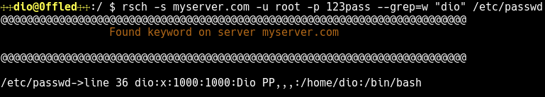
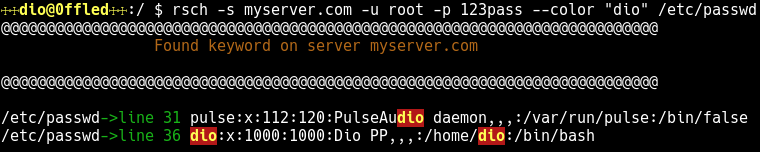

# The Remote Search utility

The rsch(Remote Search) app is an utility that allow you to make remote searches according given one or more keyword pattern.

# How it works

You can run the **rsch** command following way:

```bash
rsch -s 192.168.0.1 -u foo -p 123 "keyword" /directory-dst/
```
where:

**-s** parameter is the IP/Hostname from server where the search will be done.</br>
**-u** parameter is the user to the remote server.</br>
**-p** parameter is the password to the remote server.</br>

and:

***keyword*** argument is the keyword match to the given pattern.</br>
***/directory-dst/(or filename)*** argument is the directory or filename destination that contains
the keyword.</br>

Follows more a related example:

```bash
rsch -s myserver.com -u root -p 123pass "dio" /etc/password
```
So, the output it will look like this:


So, how you can see output above, it has been matched two lines with the keyword "dio". The first line has been matched the word "**PulseAudio**". The second line has been matched the words "**dio**" and "**Dio**".
 
The **rsch** utility wrapper the **grep** utility, so, you can use the same options that you use in the grep command. Let's suppose that you want just matcher the word "dio". In this case, you could use the parameter **-w** or **--word-regexp**, available in grep command, which ensures us select only those lines containing matches that form whole words. To use the option **-w** or any another available in grep command, just only add the -g or --grep option in rsch command followed with desired option. E.g:

```bash
rsch -s myserver.com -u root -p 123pass --grep=w "dio" /etc/passwd
```
So, the output will look just the line containing the matches that form whole words:



An another option available in grep command is the **-i** or **--ignore-case**, which ignores case distinctions in both the pattern and the input files. E.g:

```bash
rsch -s myserver.com -u root -p 123pass --grep=wi "dio" /etc/passwd
```
Will match both, lowercase and/or uppercase whole word **dio** or **Dio**. Therefore, without the option **-i** or **--ignore-case**, only the word **dio** would be match. 

The **rsch** utility provides their own system of highlighting color, that surrounds the keyword and their corresponding line matched. If you want use it, just only add the option **-c** or **--color**. E:g

```bash
rsch -s myserver.com -u root -p 123pass --color "dio" /etc/passwd
```
The output:


 
