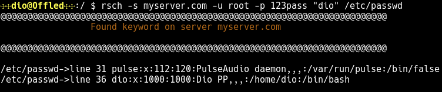

# The Remote Search utility

The rsch(Remote Search) app is an utility that allow you to make remote searches according given one or more keyword pattern.

# How it works

You can run the **rsch** command following way:

```bash
rsch -s 192.168.0.1 -u foo -p 123 "keyword" /directory-dst/
```
where:

**-s** parameter is the IP/Hostname from server where the search will be done.</br>
**-u** parameter is the user to the remote server.</br>
**-p** parameter is the password to the remote server.</br>

and:

***keyword*** argument is the keyword match to the given pattern.</br>
***/directory-dst/(or filename)*** argument is the directory or filename destination that contains
the keyword.</br>

Follows more a related example:

```bash
rsch -s myserver.com -u root -p 123pass "dio" /etc/password
```

So, the output it will look like this:


